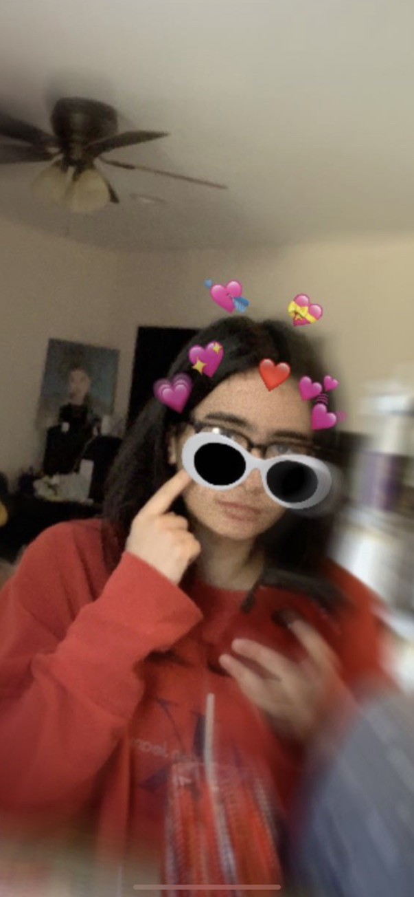
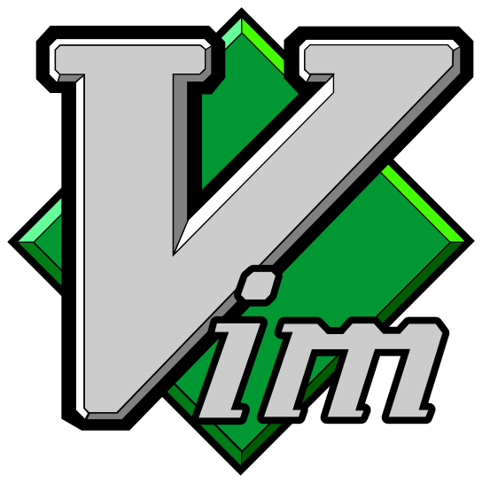

# **Welcome to Shol's Page!**
[](https://discordapp.com/users/[301450820963139584]) [](https://instagram.com/_sholll_?igshid=YmMyMTA2M2Y=)

<br/>

>### Contents:
>1. [About Me](#about-me)
>2. [Languages and Tools](#languages-and-tools)
>3. [Other](#other)

<br/>

---


## *About Me*

```
Sholehani Hafezi
```

<div align="center"> 



Hi! My nickname is Shol. I'm a Computer Science major here at UCSD looking for meaningful ways to develop my network and technical skills. My main goal in this field surrounds  developing projects that serves undereprentated conflicts/communities and that advocates for accessibility. Hobbies of mine include ice skating, video games, and hanging out with freinds and family. I look forward to the challenges this course has to offer.

<br/>

---


<div align="left">

## *Languages and Tools*

<div align="center"> 

  

  

<div align="left">

> *Note: Languages and tools above do not indicate my skill level or my preferences.*

<br/>

---


## Other

---

- [x] Relative Link:

    [README.md](README.md)
